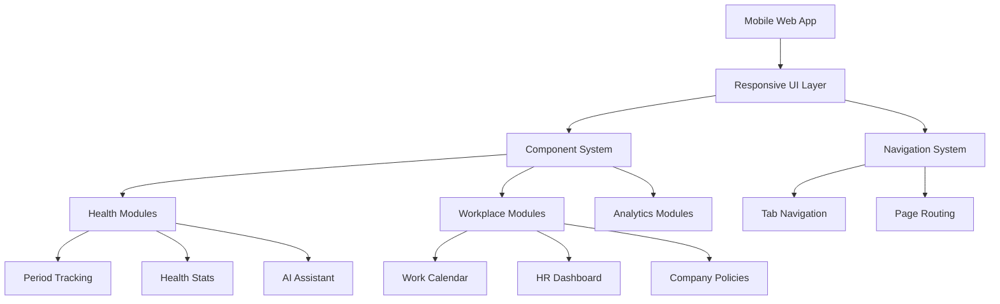
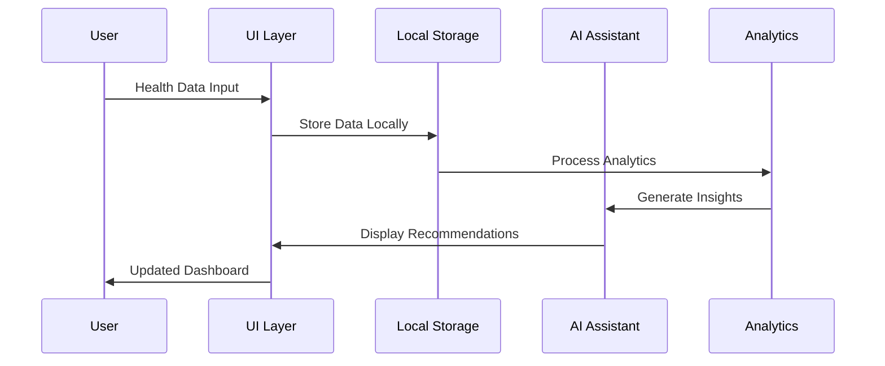

<div align="center">
 <h1>🌸 Sanicle FemTech Mobile<br/><small>AI-Powered Workplace Wellness for Women</small></h1>
 
 
 
 
 
 
</div>

> [!IMPORTANT]
> This is a comprehensive mobile web application designed specifically for workplace female health management. It combines period tracking, menopause support, health analytics, company wellness policies, and AI-powered health assistance in a unified platform optimized for mobile devices.

# 🌟 Introduction

A revolutionary mobile-first web application that transforms workplace wellness for women. This comprehensive FemTech platform provides personalized health tracking, cycle management, workplace integration, AI-powered insights, and company policy management. Built with modern web technologies and optimized for mobile devices, it delivers a seamless experience for both employees and HR departments.

> [!NOTE]
> - Mobile-first responsive design
> - Progressive Web App (PWA) ready
> - Offline capability support
> - iOS-style UI/UX design
> - Cross-platform compatibility
> - Enterprise-grade security

<br/>

[](https://chanmeng666.github.io/sanicle-ai-mobile/)

<br/>

## ✨ Key Features

🎯 **Employee-Centric Health Management**
- Personal health dashboard with cycle insights
- Period and ovulation tracking with predictions
- Mood and symptom monitoring
- Personalized health recommendations

📊 **Advanced Health Analytics**
- Real-time health metrics visualization
- Trend analysis and pattern recognition
- Cycle phase-based insights
- Interactive charts and graphs

🤖 **AI-Powered Health Assistant**
- Conversational health guidance
- Personalized recommendations
- Symptom analysis and insights
- 24/7 intelligent support

🏢 **Workplace Integration**
- Work calendar with health awareness
- Task scheduling based on cycle phases
- Team collaboration features
- Flexible work arrangement tools

## 📚 Table of Contents

- [🌟 Introduction](#-introduction)
  - [✨ Key Features](#-key-features)
  - [📚 Table of Contents](#-table-of-contents)
  - [🛠️ Tech Stack](#️-tech-stack)
  - [🏗️ Architecture Overview](#️-architecture-overview)
    - [Mobile-First Architecture](#mobile-first-architecture)
    - [Component Structure](#component-structure)
    - [Data Flow Architecture](#data-flow-architecture)
  - [📂 Project Structure](#-project-structure)
  - [🚀 Getting Started](#-getting-started)
    - [Prerequisites](#prerequisites)
    - [Quick Start Installation](#quick-start-installation)
    - [Local Development](#local-development)
  - [📱 Application Modules](#-application-modules)
    - [Employee Dashboard](#employee-dashboard)
    - [Health Tracking](#health-tracking)
    - [Workplace Integration](#workplace-integration)
    - [AI Assistant](#ai-assistant)
  - [🎨 Design System](#-design-system)
  - [📖 Development Guide](#-development-guide)
    - [Adding New Features](#adding-new-features)
    - [Customizing the UI](#customizing-the-ui)
    - [Performance Optimization](#performance-optimization)
  - [🚀 Deployment](#-deployment)
    - [Static Hosting](#static-hosting)
    - [Progressive Web App](#progressive-web-app)
    - [Enterprise Deployment](#enterprise-deployment)
  - [🤝 Contributing](#-contributing)
  - [📄 License](#-license)
  - [🙋‍♀️ Author](#️-author)

## 🛠️ Tech Stack

<div align="center">
  <table>
    <tr>
      <td align="center" width="96">
        
        <br>HTML5
      </td>
      <td align="center" width="96">
        
        <br>CSS3
      </td>
      <td align="center" width="96">
        
        <br>JavaScript
      </td>
      <td align="center" width="96">
        
        <br>Tailwind CSS
      </td>
      <td align="center" width="96">
        
        <br>Chart.js
      </td>
      <td align="center" width="96">
        
        <br>Font Awesome
      </td>
    </tr>
  </table>
</div>

> [!TIP]
> The tech stack is carefully chosen for optimal mobile performance, progressive enhancement, and cross-platform compatibility. The vanilla web approach ensures fast loading times and broad device support.

## 🏗️ Architecture Overview

### Mobile-First Architecture

The application follows a mobile-first design philosophy with responsive layouts optimized for various screen sizes:



### Component Structure

Built with modular HTML components and reusable CSS classes:

- **Page Templates**: Consistent layout structure across all screens
- **UI Components**: Reusable cards, buttons, forms, and navigation elements
- **Design System**: Comprehensive CSS variables and utility classes
- **Interactive Elements**: JavaScript-enhanced user interactions

### Data Flow Architecture



## 📂 Project Structure

```
sanicle-ai-mobile/
├── app/
│   ├── css/
│   │   └── sanicle-ui.css          # Comprehensive design system
│   └── pages/
│       ├── template.html           # Base template for all pages
│       ├── employee-dashboard.html # Personal health dashboard
│       ├── period-calendar.html    # Menstrual cycle tracking
│       ├── work-calendar.html      # Workplace integration
│       ├── health-events.html      # Company wellness events
│       ├── health-stats.html       # Analytics and insights
│       ├── ai-assistant.html       # AI health assistant
│       ├── health-policies.html    # Company health policies
│       ├── hr-dashboard.html       # HR management interface
│       ├── hr-analytics.html       # HR analytics and reporting
│       └── profile-settings.html   # User account management
├── public/
│   └── img/
│       └── sanicle_logo.svg       # Brand assets
├── index.html                     # Main demo showcase
├── README.md                      # Project documentation
└── LICENSE                       # MIT License
```

## 🚀 Getting Started

### Prerequisites

> [!IMPORTANT]
> Ensure you have the following:
> - Modern web browser (Chrome, Firefox, Safari, Edge)
> - Local web server for development
> - Git for version control
> - Code editor (VS Code recommended)

### Quick Start Installation

**1. Clone the Repository:**

```bash
# Clone the repository
git clone https://github.com/ChanMeng666/sanicle-ai-mobile.git
cd sanicle-ai-mobile
```

**2. Serve the Application:**

```bash
# Using Python's built-in server
python -m http.server 8000

# Or using Node.js live-server
npm install -g live-server
live-server

# Or using VS Code Live Server extension
# Open project in VS Code and use Live Server
```

**3. Access the Application:**

- **Main Demo**: http://localhost:8000
- **Employee Dashboard**: http://localhost:8000/app/pages/employee-dashboard.html
- **Period Calendar**: http://localhost:8000/app/pages/period-calendar.html
- **AI Assistant**: http://localhost:8000/app/pages/ai-assistant.html

### Local Development

**Development Workflow:**

```bash
# Start development server
npm run dev

# Or use any static file server
# The app is pure HTML/CSS/JS - no build process required

# For mobile testing, use ngrok for external access
ngrok http 8000
```

## 📱 Application Modules

### Employee Dashboard

**Features:**
- Personal health overview with cycle progress
- Health metrics visualization
- Personalized recommendations
- Quick access to all features

**Key Components:**
- Cycle progress indicator
- Health metrics cards
- Recommendation panels
- Navigation shortcuts

### Health Tracking

**Period Calendar:**
- Interactive calendar with cycle visualization
- Period prediction and tracking
- Fertility window indicators
- Mood and symptom logging

**Health Stats:**
- Comprehensive analytics dashboard
- Trend analysis and insights
- Cycle phase correlations
- Performance metrics

### Workplace Integration

**Work Calendar:**
- Integrated work and health scheduling
- Task prioritization based on cycle phases
- Team collaboration features
- Flexible work arrangement tools

**HR Dashboard:**
- Employee wellness overview
- Policy management
- Analytics and reporting
- Team health insights

### AI Assistant

**Conversational Interface:**
- Natural language health queries
- Personalized advice and recommendations
- Symptom analysis and guidance
- 24/7 intelligent support

**Smart Features:**
- Context-aware responses
- Learning from user patterns
- Proactive health suggestions
- Educational content delivery

## 🎨 Design System

The application uses a comprehensive design system built with CSS custom properties:

**Color Palette:**
```css
:root {
  --primary: #167d83;      /* Sanicle teal */
  --accent: #EE4C23;       /* Energetic orange */
  --success: #10B981;      /* Success green */
  --warning: #F59E0B;      /* Warning amber */
  --destructive: #EF4444;  /* Error red */
}
```

**Typography System:**
- **Font Family**: Apple system fonts for native feel
- **Scale**: Harmonious type scale for mobile readability
- **Hierarchy**: Clear information hierarchy

**Component Library:**
- Cards, buttons, forms, navigation
- Interactive elements and animations
- Responsive grid system
- Accessibility-compliant design

## 📖 Development Guide

### Adding New Features

**1. Create New Page:**

```html
<!-- app/pages/new-feature.html -->
<!DOCTYPE html>
<html lang="en">
<head>
    <!-- Copy head from template.html -->
</head>
<body>
    <!-- iOS Status Bar -->
    <div class="status-bar">
        <div>9:41</div>
        <div>
            <span class="mr-2"><i class="fas fa-signal"></i></span>
            <span class="mr-2"><i class="fas fa-wifi"></i></span>
            <span><i class="fas fa-battery-full"></i></span>
        </div>
    </div>
    
    <!-- Navigation Bar -->
    <div class="nav-bar">
        <div class="text-xl font-semibold">Feature Name</div>
        <div>
            <i class="fas fa-bell text-gray-500 mr-4"></i>
            <i class="fas fa-cog text-gray-500"></i>
        </div>
    </div>
    
    <!-- Main Content -->
    <div class="content">
        <!-- Your feature content here -->
    </div>
    
    <!-- Tab Bar -->
    <div class="tab-bar">
        <!-- Copy tab navigation from template -->
    </div>
</body>
</html>
```

**2. Update Navigation:**

Add the new feature to the main index.html demo and update tab navigation across pages.

### Customizing the UI

**Modify Design System:**

```css
/* app/css/sanicle-ui.css */
:root {
  /* Update color variables */
  --primary: #your-color;
  --accent: #your-accent;
  
  /* Modify component styles */
  .card {
    /* Custom card styling */
  }
}
```

**Add New Components:**

```css
.new-component {
  background-color: var(--background);
  border-radius: 16px;
  padding: 16px;
  box-shadow: 0 2px 10px rgba(0,0,0,0.05);
}
```

### Performance Optimization

**Mobile Optimization:**
- Optimize images and assets
- Implement lazy loading
- Use CSS transforms for animations
- Minimize JavaScript bundle size

**Progressive Enhancement:**
- Core functionality without JavaScript
- Enhanced experience with JS enabled
- Offline capability with service workers
- Progressive Web App features

## 🚀 Deployment

### Static Hosting

**Vercel Deployment:**

```bash
# Install Vercel CLI
npm i -g vercel

# Deploy
vercel

# Custom domain
vercel --prod
```

**Netlify Deployment:**

```bash
# Drag and drop deployment
# Or connect GitHub repository for continuous deployment
```

### Progressive Web App

**Add PWA Manifest:**

```json
{
  "name": "Sanicle FemTech Mobile",
  "short_name": "Sanicle",
  "description": "Workplace wellness for women",
  "start_url": "/",
  "display": "standalone",
  "background_color": "#167d83",
  "theme_color": "#167d83",
  "icons": [
    {
      "src": "/icon-192.png",
      "sizes": "192x192",
      "type": "image/png"
    }
  ]
}
```

**Service Worker:**

```javascript
// sw.js
self.addEventListener('install', (event) => {
  event.waitUntil(
    caches.open('sanicle-v1').then((cache) => {
      return cache.addAll([
        '/',
        '/app/css/sanicle-ui.css',
        '/app/pages/employee-dashboard.html'
      ]);
    })
  );
});
```

### Enterprise Deployment

**Security Considerations:**
- HTTPS enforcement
- Content Security Policy
- Access control and authentication
- Data privacy compliance

**Scalability:**
- CDN configuration
- Performance monitoring
- Error tracking
- Analytics integration

## 🤝 Contributing

We welcome contributions to Sanicle FemTech Mobile! Here's how you can help:

**Development Process:**

1. **Fork and Clone:**
```bash
git clone https://github.com/ChanMeng666/sanicle-ai-mobile.git
cd sanicle-ai-mobile
```

2. **Create Feature Branch:**
```bash
git checkout -b feature/amazing-new-feature
```

3. **Development Guidelines:**
- ✅ Follow mobile-first design principles
- ✅ Maintain accessibility standards (WCAG 2.1)
- ✅ Test on multiple devices and browsers
- ✅ Use semantic HTML and proper CSS structure
- ✅ Add comprehensive documentation

4. **Submit Pull Request:**
- Provide clear description of changes
- Include screenshots for UI changes
- Test thoroughly on mobile devices
- Update documentation as needed

**Issue Reporting:**
- 🐛 Bug reports with device/browser info
- 💡 Feature requests with use cases
- 📚 Documentation improvements
- 🎨 UI/UX enhancements

## 📄 License

This project is licensed under the MIT License - see the [LICENSE](LICENSE) file for details.

## 🙋‍♀️ Author

**Chan Meng** - Senior AI/ML Infrastructure Engineer
-  LinkedIn: [chanmeng666](https://www.linkedin.com/in/chanmeng666/)
-  GitHub: [ChanMeng666](https://github.com/ChanMeng666)
-  Email: chanmeng.dev@gmail.com

---

<div align="center">
<strong>🌸 Empowering Women's Workplace Wellness 💖</strong>
<br/>
<em>Mobile-first health management for the modern workplace</em>
<br/><br/>
⭐ Star us on GitHub | 📖 Read the Docs | 🐛 Report Issues | 💡 Request Features
<br/><br/>


</div>
 
